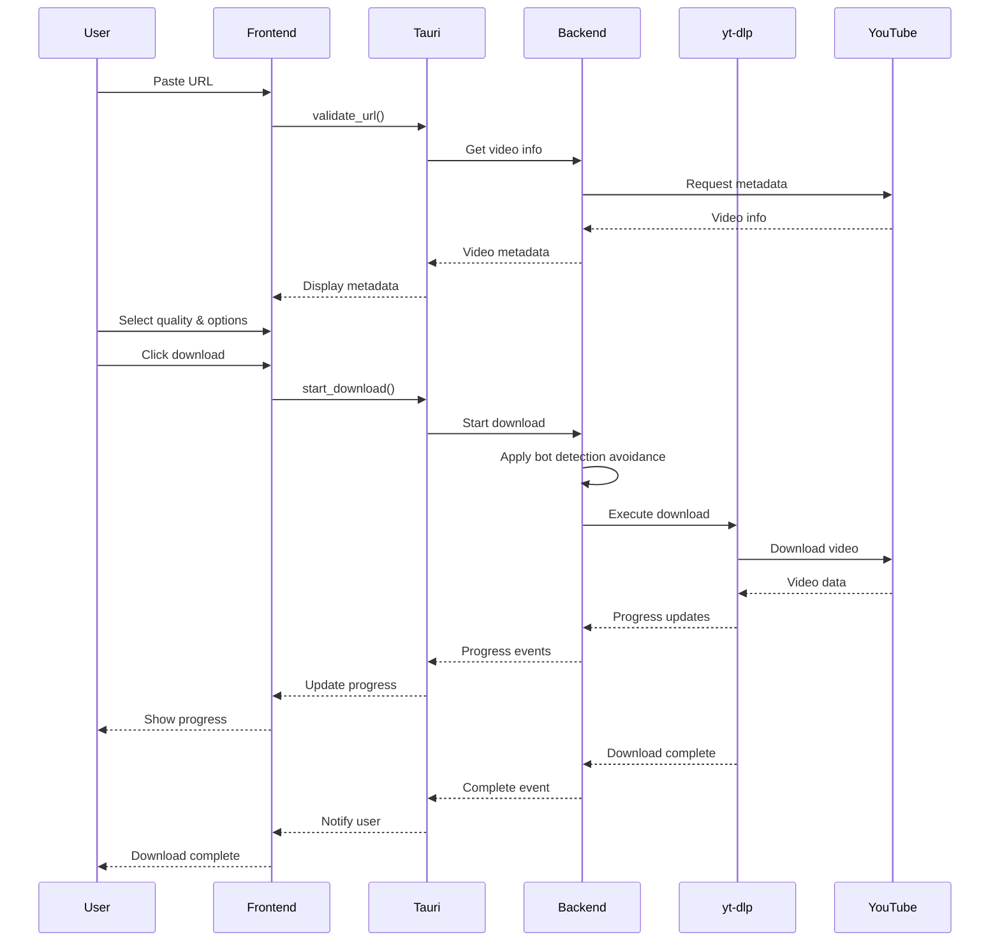
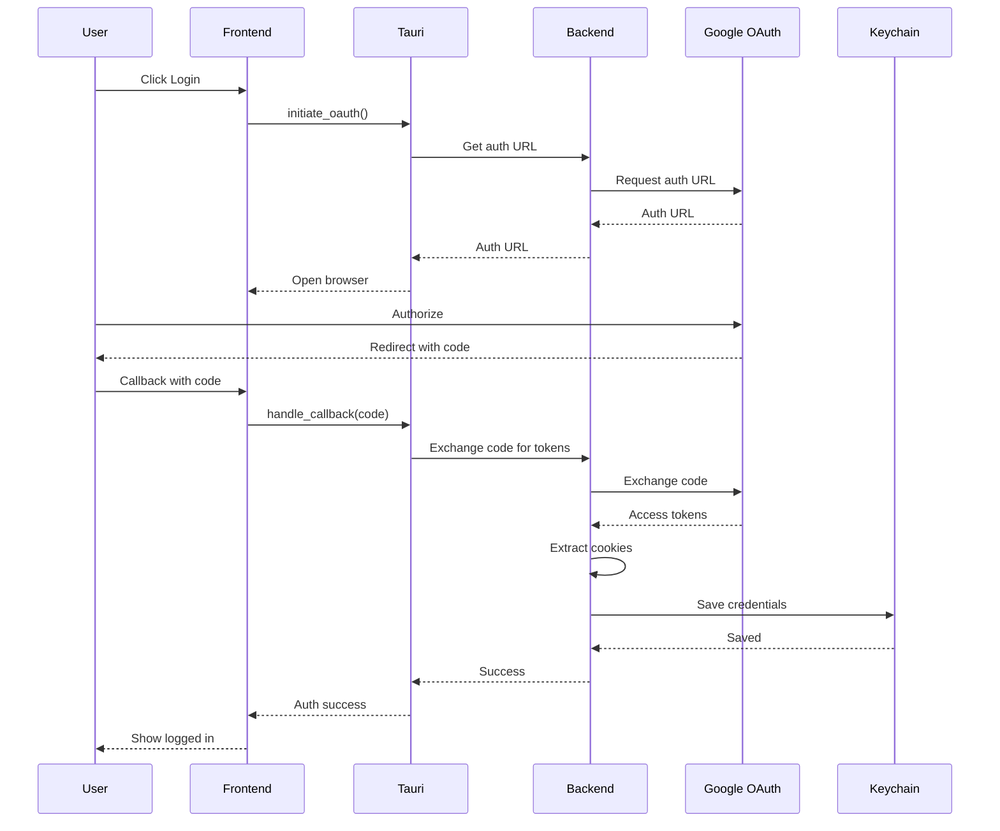

# YouTube Downloader - Architecture Design

## Overview
A standalone macOS desktop application for downloading YouTube videos with authentication support, quality selection, and bot detection avoidance.

## Technology Stack

### Core Technologies
- **Runtime**: Bun (for fast JavaScript/TypeScript execution)
- **Desktop Framework**: Tauri (lightweight, secure, Rust-based)
- **Frontend Framework**: React + Vite (modern, fast development)
- **UI Component Library**: shadcn/ui (accessible, customizable)
- **State Management**: Zustand (lightweight, simple)
- **YouTube Downloader**: yt-dlp (via Bun subprocess)
- **Authentication**: OAuth 2.0 + Cookie-based auth
- **Credential Storage**: macOS Keychain (via Tauri)

### Why This Stack?
1. **Bun**: Faster than Node.js, native TypeScript support, smaller bundle size
2. **Tauri**: Lightweight (~3-5MB vs Electron's ~100MB), better security, native performance
3. **yt-dlp**: Most robust YouTube downloader, actively maintained, handles authentication well
4. **React + Vite**: Fast development, large ecosystem, excellent tooling

## System Architecture

```
┌─────────────────────────────────────────────────────────────────┐
│                         Desktop App (macOS)                      │
├─────────────────────────────────────────────────────────────────┤
│                                                                  │
│  ┌──────────────────────────────────────────────────────────┐  │
│  │                   Frontend (React)                        │  │
│  │  ┌─────────────┐  ┌─────────────┐  ┌─────────────┐      │  │
│  │  │ URL Input   │  │ Quality     │  │ Subtitle    │      │  │
│  │  │ Component   │  │ Selector    │  │ Options     │      │  │
│  │  └─────────────┘  └─────────────┘  └─────────────┘      │  │
│  │  ┌─────────────┐  ┌─────────────┐  ┌─────────────┐      │  │
│  │  │ Auth        │  │ Save        │  │ Download    │      │  │
│  │  │ Component   │  │ Location    │  │ Progress    │      │  │
│  │  └─────────────┘  └─────────────┘  └─────────────┘      │  │
│  │  ┌────────────────────────────────────────────────────┐   │  │
│  │  │ Recent Downloads List (double-click to open)      │   │  │
│  │  └────────────────────────────────────────────────────┘   │  │
│  └──────────────────────────────────────────────────────────┘  │
│                           ↓ Tauri IPC                           │
│  ┌──────────────────────────────────────────────────────────┐  │
│  │              Tauri Core (Rust)                           │  │
│  │  ┌─────────────┐  ┌─────────────┐  ┌─────────────┐      │  │
│  │  │ Window      │  │ File        │  │ Keychain    │      │  │
│  │  │ Manager     │  │ Dialogs     │  │ Access      │      │  │
│  │  └─────────────┘  └─────────────┘  └─────────────┘      │  │
│  └──────────────────────────────────────────────────────────┘  │
│                           ↓ Commands                           │
│  ┌──────────────────────────────────────────────────────────┐  │
│  │              Backend Services (Bun)                        │  │
│  │  ┌─────────────┐  ┌─────────────┐  ┌─────────────┐      │  │
│  │  │ yt-dlp      │  │ Auth        │  │ File        │      │  │
│  │  │ Wrapper     │  │ Manager     │  │ Manager     │      │  │
│  │  └─────────────┘  └─────────────┘  └─────────────┘      │  │
│  │  ┌─────────────┐  ┌─────────────┐  ┌─────────────┐      │  │
│  │  │ Progress    │  │ Queue       │  │ Bot         │      │  │
│  │  │ Tracker     │  │ Manager     │  │ Detection   │      │  │
│  │  └─────────────┘  └─────────────┘  └─────────────┘      │  │
│  │  ┌────────────────────────────────────────────────────┐   │  │
│  │  │ Recent Downloads Manager (persist & search)        │   │  │
│  │  └────────────────────────────────────────────────────┘   │  │
│  └──────────────────────────────────────────────────────────┘  │
│                           ↓                                    │
│  ┌──────────────────────────────────────────────────────────┐  │
│  │              External Services                            │  │
│  │  ┌─────────────┐  ┌─────────────┐  ┌─────────────┐      │  │
│  │  │ YouTube     │  │ OAuth 2.0   │  │ File System │      │  │
│  │  │ API         │  │ Provider    │  │             │      │  │
│  │  └─────────────┘  └─────────────┘  └─────────────┘      │  │
│  └──────────────────────────────────────────────────────────┘  │
│                                                                  │
└─────────────────────────────────────────────────────────────────┘
```

## Component Details

### Frontend (React + Vite)

#### UI Components
1. **URL Input Component**
   - Text input for YouTube URL
   - URL validation
   - Video metadata preview (title, thumbnail, duration)

2. **Quality Selector**
   - Dropdown with available video qualities
   - Format options (MP4, WebM, MKV)
   - Default: Best available quality

3. **Subtitle Options**
   - Checkbox for subtitle download
   - Language selection dropdown
   - Format options (SRT, VTT, ASS)

4. **Authentication Component**
   - Login with Google button
   - OAuth 2.0 flow
   - Cookie management UI
   - Logout option

5. **Save Location Picker**
   - Native file dialog integration
   - Recent locations history
   - Default location setting

6. **Download Progress**
   - Progress bar
   - Speed indicator
   - ETA display
   - Cancel button

7. **Recent Downloads List**
   - List of recently downloaded files
   - File metadata (title, size, date, thumbnail)
   - Double-click to open video in default player
   - Right-click context menu (open in folder, delete, redownload)
   - Search/filter functionality

8. **Download Queue**
   - List of queued downloads
   - Queue management (pause, resume, cancel)
   - Download history

#### State Management (Zustand)
```typescript
interface AppStore {
  // Auth state
  isAuthenticated: boolean
  user: User | null
  cookies: Cookie[]

  // Download state
  currentUrl: string
  videoMetadata: VideoMetadata | null
  selectedQuality: VideoQuality
  selectedSubtitles: SubtitleOptions
  saveLocation: string

  // Queue state
  downloadQueue: DownloadItem[]
  activeDownloads: Map<string, DownloadProgress>

  // Recent downloads state
  recentDownloads: RecentDownload[]
  searchQuery: string

  // Actions
  setUrl: (url: string) => void
  setQuality: (quality: VideoQuality) => void
  setSubtitles: (options: SubtitleOptions) => void
  setSaveLocation: (path: string) => void
  addToQueue: (item: DownloadItem) => void
  removeFromQueue: (id: string) => void
  startDownload: (id: string) => void
  cancelDownload: (id: string) => void
  loadRecentDownloads: () => Promise<void>
  openFile: (path: string) => Promise<void>
  openInFolder: (path: string) => Promise<void>
  deleteFile: (path: string) => Promise<void>
  clearRecentDownloads: () => Promise<void>
  setSearchQuery: (query: string) => void
}
```

### Backend (Bun + Tauri)

#### Tauri Commands
```rust
// src-tauri/src/commands.rs

#[tauri::command]
async fn validate_url(url: String) -> Result<VideoMetadata, String>

#[tauri::command]
async fn get_video_info(url: String) -> Result<VideoInfo, String>

#[tauri::command]
async fn get_available_formats(url: String) -> Result<Vec<VideoFormat>, String>

#[tauri::command]
async fn get_available_subtitles(url: String) -> Result<Vec<Subtitle>, String>

#[tauri::command]
async fn start_download(options: DownloadOptions) -> Result<String, String>

#[tauri::command]
async fn cancel_download(id: String) -> Result<(), String>

#[tauri::command]
async fn get_download_progress(id: String) -> Result<DownloadProgress, String>

#[tauri::command]
async fn save_credentials(credentials: Credentials) -> Result<(), String>

#[tauri::command]
async fn load_credentials() -> Result<Credentials, String>

#[tauri::command]
async fn clear_credentials() -> Result<(), String>

#[tauri::command]
async fn select_save_location() -> Result<String, String>

#[tauri::command]
async fn get_recent_downloads() -> Result<Vec<RecentDownload>, String>

#[tauri::command]
async fn open_file(path: String) -> Result<(), String>

#[tauri::command]
async fn open_in_folder(path: String) -> Result<(), String>

#[tauri::command]
async fn delete_file(path: String) -> Result<(), String>

#[tauri::command]
async fn clear_recent_downloads() -> Result<(), String>
```

#### yt-dlp Wrapper Service
```typescript
// src/services/ytdlp.ts

interface YtDlpOptions {
  url: string
  format: string
  output: string
  subtitles?: boolean
  subtitleLangs?: string[]
  cookies?: string
  userAgent?: string
  referer?: string
  proxy?: string
}

class YtDlpService {
  async getVideoInfo(url: string): Promise<VideoInfo>
  async getFormats(url: string): Promise<VideoFormat[]>
  async getSubtitles(url: string): Promise<Subtitle[]>
  async download(options: YtDlpOptions): Promise<DownloadProcess>
  async cancelDownload(pid: number): Promise<void>
}
```

#### Authentication Manager
```typescript
// src/services/auth.ts

class AuthManager {
  async initiateOAuth(): Promise<AuthUrl>
  async handleCallback(code: string): Promise<Tokens>
  async refreshTokens(): Promise<Tokens>
  async getCookies(): Promise<Cookie[]>
  async saveCookies(cookies: Cookie[]): Promise<void>
  async clearAuth(): Promise<void>
}
```

#### Bot Detection Avoidance
```typescript
// src/services/bot-detection.ts

class BotDetectionAvoidance {
  private userAgent: string
  private cookies: Cookie[]
  private rateLimiter: RateLimiter

  constructor() {
    this.userAgent = this.generateRealisticUserAgent()
    this.rateLimiter = new RateLimiter({
      requests: 3,
      period: 60000 // 1 minute
    })
  }

  private generateRealisticUserAgent(): string {
    // Rotate through realistic user agents
    const userAgents = [
      'Mozilla/5.0 (Macintosh; Intel Mac OS X 10_15_7) AppleWebKit/537.36',
      'Mozilla/5.0 (Macintosh; Intel Mac OS X 10_15_7) Chrome/120.0.0.0 Safari/537.36',
      'Mozilla/5.0 (Macintosh; Intel Mac OS X 10_15_7) Safari/605.1.15'
    ]
    return userAgents[Math.floor(Math.random() * userAgents.length)]
  }

  async beforeRequest(): Promise<void> {
    await this.rateLimiter.wait()
    // Add random delay (1-3 seconds)
    await this.sleep(1000 + Math.random() * 2000)
  }

  getHeaders(): Record<string, string> {
    return {
      'User-Agent': this.userAgent,
      'Accept': 'text/html,application/xhtml+xml,application/xml;q=0.9,*/*;q=0.8',
      'Accept-Language': 'en-US,en;q=0.9',
      'Accept-Encoding': 'gzip, deflate, br',
      'DNT': '1',
      'Connection': 'keep-alive',
      'Upgrade-Insecure-Requests': '1',
      'Sec-Fetch-Dest': 'document',
      'Sec-Fetch-Mode': 'navigate',
      'Sec-Fetch-Site': 'none',
      'Sec-Fetch-User': '?1',
      'Cache-Control': 'max-age=0'
    }
  }

  getCookiesHeader(): string {
    return this.cookies.map(c => `${c.name}=${c.value}`).join('; ')
  }
}
```

#### Recent Downloads Manager
```typescript
// src/services/recent-downloads.ts

interface RecentDownload {
  id: string
  title: string
  url: string
  filePath: string
  thumbnail: string
  size: number
  duration: number
  quality: string
  downloadedAt: Date
  format: string
}

class RecentDownloadsManager {
  private storagePath: string
  private maxItems: number = 100

  async addDownload(download: RecentDownload): Promise<void> {
    const downloads = await this.getRecentDownloads()
    const existingIndex = downloads.findIndex(d => d.id === download.id)

    if (existingIndex >= 0) {
      downloads[existingIndex] = download
    } else {
      downloads.unshift(download)
    }

    // Keep only the most recent items
    const trimmed = downloads.slice(0, this.maxItems)
    await this.saveToStorage(trimmed)
  }

  async getRecentDownloads(): Promise<RecentDownload[]> {
    const data = await Bun.file(this.storagePath).text()
    return JSON.parse(data || '[]')
  }

  async searchDownloads(query: string): Promise<RecentDownload[]> {
    const downloads = await this.getRecentDownloads()
    const lowerQuery = query.toLowerCase()

    return downloads.filter(d =>
      d.title.toLowerCase().includes(lowerQuery) ||
      d.url.toLowerCase().includes(lowerQuery)
    )
  }

  async deleteDownload(id: string): Promise<void> {
    const downloads = await this.getRecentDownloads()
    const filtered = downloads.filter(d => d.id !== id)
    await this.saveToStorage(filtered)
  }

  async clearAll(): Promise<void> {
    await this.saveToStorage([])
  }

  private async saveToStorage(downloads: RecentDownload[]): Promise<void> {
    await Bun.write(this.storagePath, JSON.stringify(downloads, null, 2))
  }
}
```

## Data Flow

### Download Flow


### Authentication Flow


## Project Structure

```
youtube_downloader/
├── src/
│   ├── components/          # React components
│   │   ├── URLInput.tsx
│   │   ├── QualitySelector.tsx
│   │   ├── SubtitleOptions.tsx
│   │   ├── AuthButton.tsx
│   │   ├── SaveLocationPicker.tsx
│   │   ├── DownloadProgress.tsx
│   │   ├── RecentDownloads.tsx
│   │   └── DownloadQueue.tsx
│   ├── services/           # Backend services
│   │   ├── ytdlp.ts
│   │   ├── auth.ts
│   │   ├── bot-detection.ts
│   │   ├── file-manager.ts
│   │   └── recent-downloads.ts
│   ├── stores/             # Zustand stores
│   │   └── app-store.ts
│   ├── types/              # TypeScript types
│   │   └── index.ts
│   ├── utils/              # Utility functions
│   │   ├── validation.ts
│   │   └── formatting.ts
│   ├── App.tsx             # Main app component
│   └── main.tsx            # Entry point
├── src-tauri/              # Tauri Rust backend
│   ├── src/
│   │   ├── main.rs         # Tauri entry point
│   │   ├── commands.rs     # Tauri commands
│   │   ├── keychain.rs     # Keychain access
│   │   └── utils.rs        # Utility functions
│   ├── Cargo.toml
│   └── tauri.conf.json     # Tauri configuration
├── public/                 # Static assets
├── package.json
├── bun.lockb
├── tsconfig.json
├── vite.config.ts
└── README.md
```

## Security Considerations

1. **Credential Storage**
   - Use macOS Keychain for storing OAuth tokens and cookies
   - Never store credentials in plain text
   - Implement secure token refresh mechanism

2. **Bot Detection Avoidance**
   - Use realistic user agents
   - Implement rate limiting
   - Add random delays between requests
   - Maintain proper cookie sessions

3. **Code Signing**
   - Sign the macOS app for distribution
   - Use proper developer certificates
   - Enable app sandboxing

4. **Input Validation**
   - Validate all YouTube URLs
   - Sanitize file paths
   - Validate user inputs

## Performance Optimization

1. **Download Performance**
   - Use yt-dlp's multi-threaded downloading
   - Implement download queue management
   - Support resumable downloads

2. **UI Performance**
   - Use React.memo for expensive components
   - Implement virtual scrolling for download queue
   - Debounce URL input validation

3. **Memory Management**
   - Clean up completed downloads
   - Limit queue size
   - Implement proper cleanup on app exit

## Testing Strategy

1. **Unit Tests**
   - Test all utility functions
   - Test service methods
   - Test state management

2. **Integration Tests**
   - Test Tauri commands
   - Test authentication flow
   - Test download flow

3. **E2E Tests**
   - Test complete download workflow
   - Test authentication flow
   - Test error handling

## Deployment

1. **Build Process**
   ```bash
   # Build for macOS
   bun run tauri build
   ```

2. **Output**
   - `.dmg` installer
   - `.app` bundle
   - Code-signed application

3. **Distribution**
   - Direct download
   - GitHub Releases
   - Optional: Mac App Store (requires additional setup)

## Future Enhancements

1. Playlist download support
2. Batch download
3. Download scheduling
4. Video conversion (format conversion)
5. Audio-only download
6. Download history with search
7. Custom format presets
8. Proxy support
9. Multi-language support
10. Dark mode
